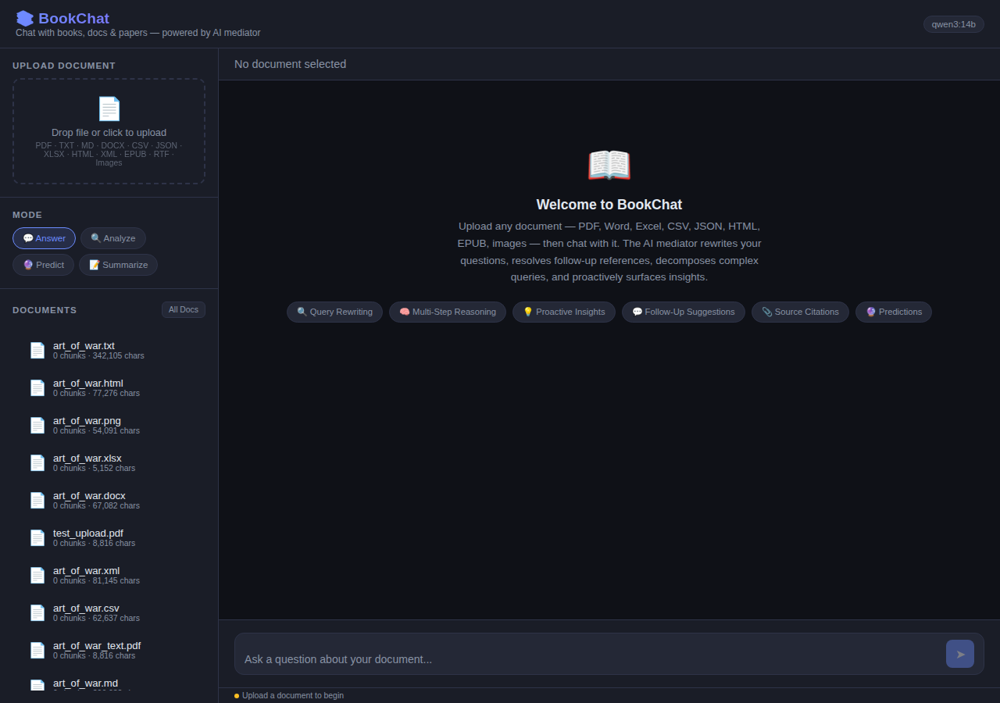
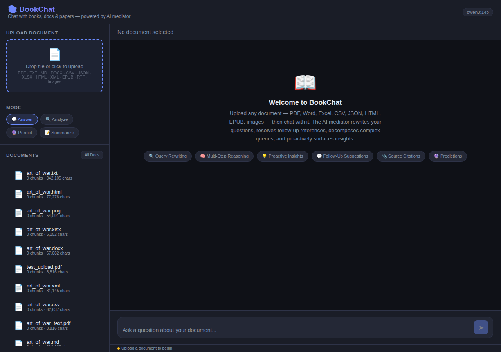
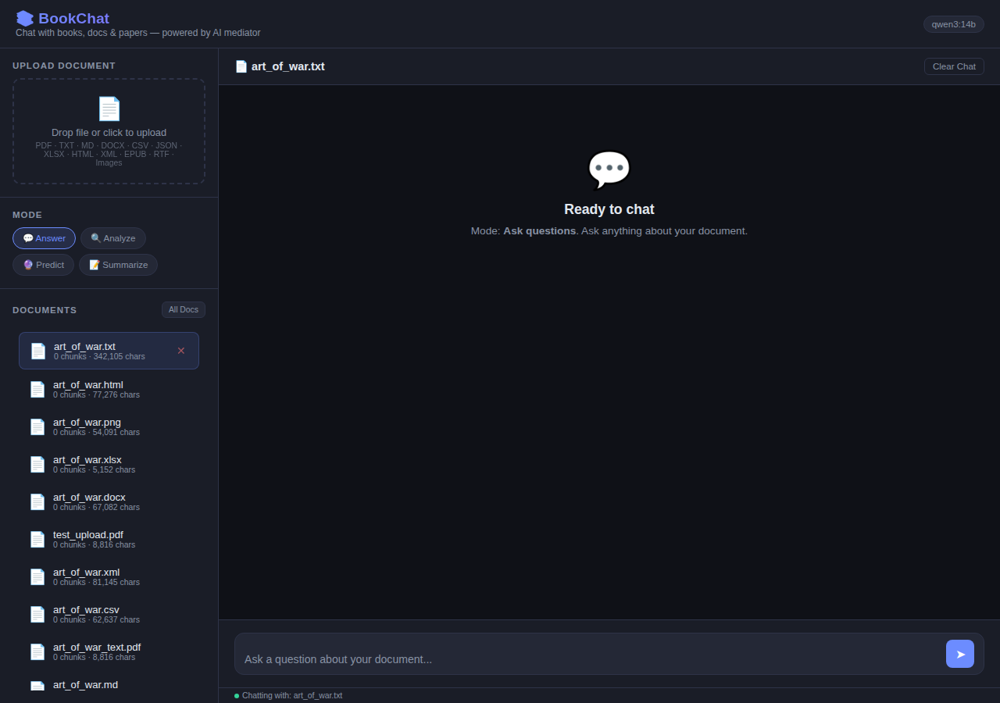
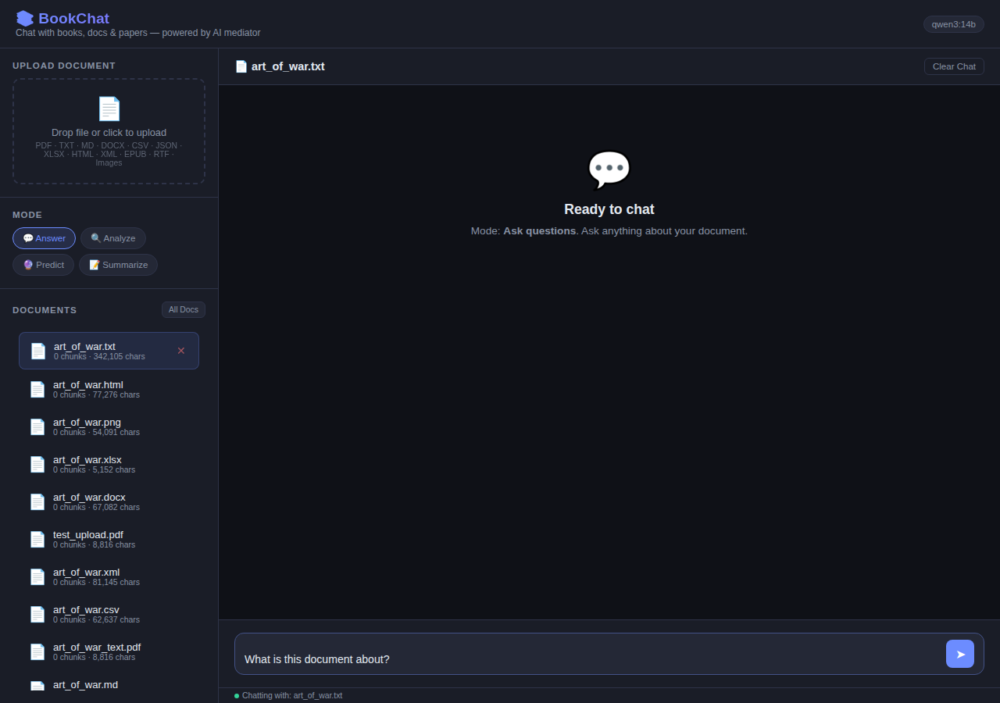
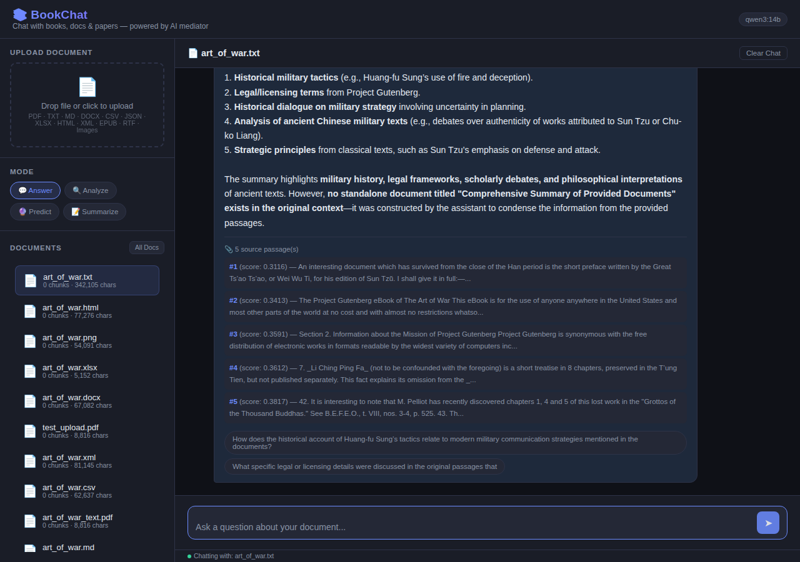
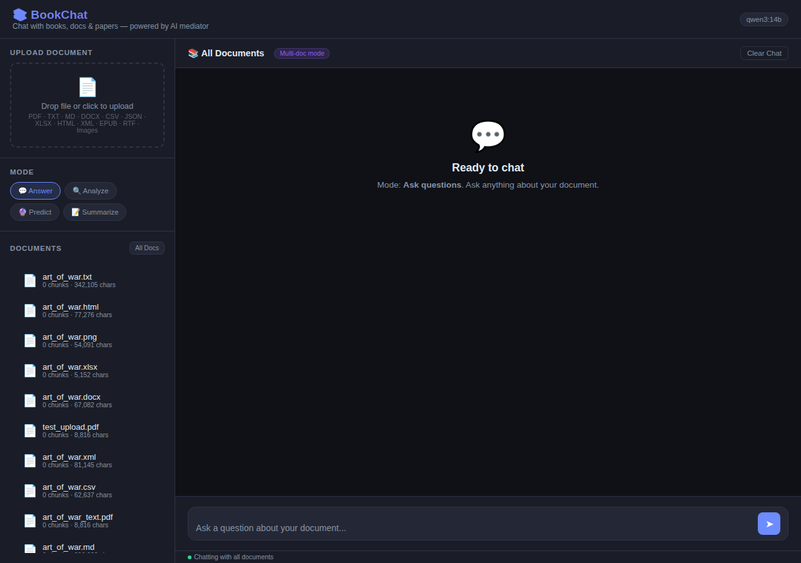

# BookChat — Chat with Your Documents

A RAG-based chat application that lets you upload documents (PDF, Word, Excel, CSV, JSON, HTML, EPUB, images, etc.) and chat with them using a local Ollama LLM. Features an AI mediator that rewrites queries, decomposes complex questions, and proactively surfaces insights.

## Table of Contents

- [Features](#features)
- [Screenshots](#screenshots)
- [Setup](#setup)
- [Architecture](#architecture)
- [API Reference](#api-reference)
- [Chat Modes](#chat-modes)
- [Multi-Document Chat](#multi-document-chat)
- [Document Support](#document-support)
- [Configuration](#configuration)
- [How It Works](#how-it-works)

---

## Features

- **21 document formats** — PDF (text + OCR), DOCX, XLSX, XLS, CSV, JSON, HTML, XML, EPUB, RTF, PNG, JPG, TIFF, BMP, WebP, TXT, MD
- **4 chat modes** — Answer, Analyze, Predict, Summarize
- **Multi-document chat** — query across all uploaded documents or select a specific one
- **Persistent registry** — uploaded documents survive server restarts
- **AI Mediator** — query rewriting, multi-step reasoning, follow-up suggestions, proactive insights
- **Source citations** — every answer cites which document passages support it
- **Dark-themed UI** — responsive chat interface with drag-and-drop upload

---

## Screenshots

### 1. Main Page — Upload, Modes, Document List



The main interface shows:
- **Header** — App name + current Ollama model badge
- **Upload zone** — Drag-and-drop or click to upload (supports 21 formats)
- **Mode selector** — Answer / Analyze / Predict / Summarize
- **Document list** — All uploaded files with chunk/char counts + "All Docs" button
- **Chat area** — Welcome message with feature highlights
- **Input area** — Question textbox + send button
- **Status bar** — Current connection status

### 2. Upload Zone



Hover effect on the upload zone. Click to open file picker or drag-and-drop any supported document format (PDF, TXT, MD, DOCX, CSV, JSON, XLSX, HTML, XML, EPUB, RTF, PNG, JPG, JPEG, TIFF, BMP, WebP).

### 3. Document Selected



After clicking a document in the sidebar:
- Document becomes highlighted (active state)
- Chat title updates to show the filename
- Send button becomes enabled
- Status bar shows "Chatting with: <filename>"
- Green status dot indicates active connection
- Clear Chat button appears

### 4. Typed Question



Type any question in the input box. The text auto-resizes for multi-line input. Press Enter or click the send button to submit.

### 5. Chat Response



Each response includes:
- **Rewritten query** (🔍) — Shows how the AI reformulated your question
- **Answer** — Grounded response with inline citations
- **Source passages** (📎) — Expandable list of retrieved chunks with relevance scores
- **Proactive insight** (💡) — Every 4turns, an interesting observation
- **Follow-up suggestions** — 3 clickable questions to continue the conversation

### 6. All Documents Mode



Click "All Docs" to enable multi-document chat:
- Title changes to "📚 All Documents"
- Purple "Multi-doc mode" badge appears in the header
- Queries search across ALL uploaded documents simultaneously
- Source citations show document ID prefixes for cross-referencing

### 7. Mode Selector


Four modes available:
| Mode | Icon | Purpose |
|------|------|---------|
| **Answer** | 💬 | Factual Q&A with citations |
| **Analyze** | 🔍 | Deep thematic analysis |
| **Predict** | 🔮 | Strategic predictions |
| **Summarize** | 📝 | Comprehensive summaries |

---

## Setup

### Prerequisites

- Python 3.10+
- Ollama running locally or on a remote server
- Git

### Installation

```bash
# Clone the repository
git clone git@github.com:sreshtantbohidar/BookChat.git
cd BookChat

# Create virtual environment
python -m venv venv
source venv/bin/activate  # Linux/Mac
# venv\Scripts\activate   # Windows

# Install dependencies
pip install -r requirements.txt

# Pull required Ollama models
ollama pull qwen3:14b
ollama pull nomic-embed-text
```

### Running

```bash
# Start the server
python app.py

# Open in browser
# http://localhost:5000
```

### Environment Variables

| Variable | Default | Description |
|----------|---------|-------------|
| `OLLAMA_URL` | `http://192.168.1.125:11434` | Ollama server URL |
| `OLLAMA_MODEL` | `qwen3:14b` | LLM model for chat and reasoning |
| `STORE_TYPE` | `chromadb` | Vector store backend: `chromadb` or `faiss` |

```bash
# Example: use local Ollama with FAISS backend
OLLAMA_URL=http://localhost:11434 OLLAMA_MODEL=llama3:8b STORE_TYPE=faiss python app.py
```

---

## Architecture

```
bookchat/
├── app.py              # Flask backend — API endpoints, upload, chat, registry
├── doc_loader.py       # Universal document loader — 21 formats via 17 loaders
├── vector_store.py     # Vector store — ChromaDB + FAISS backends, Ollama embeddings
├── rag_engine.py       # RAG engine — retrieval + generation with 4 modes
├── mediator.py         # AI mediator — query rewrite, multi-step reasoning,
                       #   follow-up suggestions, proactive insights, multi-doc chat
├── requirements.txt    # Python dependencies
├── docs/
│   └── screenshots/    # UI screenshots for documentation
├── templates/
│   └── index.html      # Chat UI — dark theme, drag-and-drop, multi-doc selector
├── samples/            # Sample test documents (14 files)
├── uploads/            # Uploaded documents (auto-created, gitignored)
├── stores/             # Vector databases (auto-created, gitignored)
├── doc_registry.json   # Document metadata cache (auto-created, gitignored)
└── README.md           # This file
```

### Data Flow

```
User Upload → doc_loader.py → text extraction
                                    │
                                    ▼
                         vector_store.py → chunking → Ollama embeddings
                                    │
                                    ▼
                         ChromaDB / FAISS (persistent storage)
                                    │
User Query ──► mediator.py ──► query rewriting
                                    │
                                    ▼
                         rag_engine.py → vector search (top-k chunks)
                                    │
                                    ▼
                         Ollama LLM → generated answer
                                    │
                                    ▼
                         Response: answer + sources + followups + insight
```

---

## API Reference

### GET /

Returns the chat UI (HTML page).

---

### POST /api/upload

Upload and ingest a document.

**Request:** `multipart/form-data`

| Field | Type | Description |
|-------|------|-------------|
| `file` | File | Document file to upload |

**Response (200):**
```json
{
  "doc_id": "a1b2c3d4...",
  "filename": "report.pdf",
  "chunks": 42,
  "chars": 15234,
  "message": "'report.pdf' ingested (42 chunks)"
}
```

**Response (400):**
```json
{"error": "No file provided"}
{"error": "Empty filename"}
{"error": "Failed to load document: <details>"}
{"error": "Document is empty"}
```

**Response (500):**
```json
{"error": "Ingestion failed: <details>"}
```

---

### GET /api/documents

List all uploaded documents.

**Response (200):**
```json
{
  "documents": [
    {
      "doc_id": "a1b2c3d4e5f6...",
      "filename": "report.pdf",
      "chunks": 42,
      "chars": 15234
    },
    {
      "doc_id": "f6e5d4c3b2a1...",
      "filename": "notes.txt",
      "chunks": 108,
      "chars": 75991
    }
  ]
}
```

---

### DELETE /api/documents/<doc_id>

Delete a document and its vector data.

**Response (200):**
```json
{"message": "Document deleted"}
```

---

### POST /api/chat

Chat with a document or across all documents.

**Request (JSON):**

| Field | Type | Required | Description |
|-------|------|----------|-------------|
| `query` | string | Yes | The question to ask |
| `doc_id` | string | Yes | Document ID or `"all"` for multi-doc chat |
| `mode` | string | No | `answer` (default), `analyze`, `predict`, `summarize` |

**Example — single document:**
```json
{
  "query": "What are the main arguments?",
  "doc_id": "a1b2c3d4e5f6...",
  "mode": "answer"
}
```

**Example — all documents:**
```json
{
  "query": "What themes appear across all documents?",
  "doc_id": "all",
  "mode": "analyze"
}
```

**Response (200):**
```json
{
  "answer": "The document argues that...",
  "sources": [
    {
      "chunk_idx": 0,
      "score": 0.3379,
      "preview": "The main argument presented is that...",
      "doc_id": "a1b2c3d4..."
    }
  ],
  "followups": [
    "How does this argument compare to alternative views?",
    "What evidence supports the main claim?",
    "What are the implications of this argument?"
  ],
  "insight": "An interesting pattern emerges when comparing passages 2 and 4...",
  "mode": "answer",
  "rewritten_query": "What are the main arguments presented in the document?",
  "reasoning_steps": [],
  "doc_id": "a1b2c3d4...",
  "filename": "report.pdf"
}
```

**Multi-doc response** includes `"doc_ids": ["id1", "id2", ...]` instead of single `doc_id`.

**Response (400):**
```json
{"error": "No JSON body"}
{"error": "Empty query"}
{"error": "No document loaded. Upload a document first."}
{"error": "No documents loaded. Upload documents first."}
```

**Response (500):**
```json
{"error": "Generation failed: <details>"}
```

---

### POST /api/chat/clear

Clear conversation history for a document.

**Request (JSON):**
```json
{"doc_id": "a1b2c3d4..."}
```

**Response (200):**
```json
{"message": "Chat history cleared"}
```

---

### GET /api/models

List available Ollama models.

**Response (200):**
```json
{
  "models": ["qwen3:14b", "llama3:8b", "gemma3:4b", ...],
  "current": "qwen3:14b"
}
```

---

## Chat Modes

### Answer (default)
**Purpose:** Factual, grounded Q&A

The LLM answers your specific question using only the retrieved document passages. It cites which passage supports each point and says when information is insufficient.

**Best for:** "What does the document say about X?", "Define concept Y", "What happened in event Z?"

**Example:**
> **Q:** What does Sun Tzu say about deception?
> **A:** Sun Tzu emphasizes deception as a foundational element: (1) "All warfare is based on deception" (Passage 1), (2) Feigning weakness — "when able to attack, we must seem unable" (Passage 1), (3) Strategic misdirection — "hold out baits to entice the enemy" (Passage 3).

---

### Analyze
**Purpose:** Deep structural and thematic analysis

Identifies key themes, patterns, relationships, underlying assumptions, strengths/weaknesses of arguments, and connections between ideas. In multi-doc mode, compares across sources.

**Best for:** "What are the main themes?", "Analyze the author's argument", "What patterns emerge?", "Compare the perspectives across documents"

**Example:**
> **Q:** Analyze the writing principles across all documents
> **A:** Three core principles emerge: (1) **Clarity** — all documents emphasize direct, unambiguous language (Passages 1, 3, 5), (2) **Structure** — logical ordering with clear sections (Passages 2, 4), (3) **Audience awareness** — adapting tone to the reader (Passages 1, 6). The military documents are more prescriptive while the academic ones are more analytical.

---

### Predict
**Purpose:** Strategic foresight and scenario planning

Derives predictions, scenarios, and possibilities from document content. Considers trends, likely future developments, opportunities, and risks. Clearly distinguishes between stated content and extrapolation.

**Best for:** "What might happen if these trends continue?", "What are the implications?", "What scenarios emerge from this data?", "Predict future developments"

**Example:**
> **Q:** What would happen if Sun Tzu's principles were applied to modern cybersecurity?
> **A:** Based on the document's principles: (1) **Deception** → honeypots and deception technology would be central (Passage 1), (2) **Know yourself and enemy** → threat intelligence becomes critical (Passage 2), (3) **Win without fighting** → prevention and deterrence over reaction (Passage 4). The document suggests that the side with better information advantage wins.

---

### Summarize
**Purpose:** Comprehensive document overview

Creates a self-contained summary covering main ideas, key points, important details, and logical structure. In multi-doc mode, synthesizes themes across all documents.

**Best for:** "Summarize this document", "Give me an overview", "What are the key takeaways?", "Summarize all documents on this topic"

**Example:**
> **Q:** Summarize the key points about military communication
> **A:** The document covers: (1) **Purpose** — briefs share information or obtain direction (Passage 1), (2) **Structure** — Aim → Recommendations → Main body → Conclusions (Passage 2), (3) **Five W's** — Who, What, When, Where, Why (Passage 3), (4) **Style** — neutral, direct, no contractions (Passage 4), (5) **Types** — situational, mission, staff briefs (Passage 5).

---

## Multi-Document Chat

### How It Works

1. **Click "All Docs"** in the sidebar to enter multi-document mode
2. The system searches across **all uploaded documents** simultaneously
3. Retrieves the top-k most relevant chunks from each document
4. Merges and ranks all results by relevance
5. Sends the top 8 chunks to the LLM with document labels
6. The LLM synthesizes a unified answer noting which document each point comes from

### When to Use

| Scenario | Recommended Mode |
|----------|-----------------|
| Compare perspectives across books | Analyze |
| Find all mentions of a topic | Answer |
| Synthesize trends from multiple sources | Predict |
| Get an overview of everything | Summarize |
| Cross-reference facts | Answer |

### Performance Notes

- Search is fast (milliseconds) regardless of document count
- LLM generation takes 30-90 seconds depending on model and mode
- Each document contributes up to 5 chunks to the context
- Total context sent to LLM: ~8000 characters (top 8 chunks)

---

## Document Support

| Category | Formats | Method |
|----------|---------|--------|
| **Text** | PDF (text), TXT, MD, RTF, EPUB | Direct text extraction |
| **PDF OCR** | Scanned PDF, images in PDF | Tesseract OCR via PyMuPDF |
| **Images** | PNG, JPG, JPEG, TIFF, BMP, WebP | Tesseract OCR |
| **Office** | DOCX (with tables) | python-docx |
| **Spreadsheets** | XLSX, XLS | openpyxl / xlrd |
| **Data** | CSV, JSON | Python stdlib |
| **Markup** | HTML, XML | BeautifulSoup + lxml |
| **E-book** | EPUB | BeautifulSoup parsing |

---

## How It Works

### Document Ingestion Pipeline

```
File Upload
    │
    ▼
doc_loader.py ──► Format detection by extension
    │
    ├─► PDF? ──► Text extract or OCR (Tesseract)
    ├─► DOCX? ──► python-docx (paragraphs + tables)
    ├─► XLSX? ──► openpyxl (all sheets)
    ├─► CSV? ──► csv.reader
    ├─► HTML/XML? ──► BeautifulSoup
    ├─► Image? ──► PIL + Tesseract OCR
    └─► TXT/MD/RTF/EPUB? ──► Direct read or striprtf
    │
    ▼
Raw text (cleaned)
    │
    ▼
vector_store.py ──► RecursiveCharacterTextSplitter
    │                    chunk_size=1000, overlap=200
    │                    separators: \n\n, \n, ". ", " ", ""
    │
    ▼
Chunks (list of ~1000-char strings)
    │
    ▼
Ollama /api/embeddings ──► nomic-embed-text model
    │
    ▼
Embeddings (768-dim vectors)
    │
    ▼
ChromaDB / FAISS ──► Persistent storage on disk
```

### Query Pipeline

```
User Question
    │
    ▼
mediator.py ──► Query Rewriting
    │              ├─ Resolve pronouns ("it", "they") using conversation history
    │              ├─ Make question specific and self-contained
    │              └─ Ollama call: 5-15 seconds
    │
    ▼
Rewritten Query
    │
    ▼
vector_store.py ──► Embed query via Ollama
    │                  └─ Cosine similarity search in ChromaDB/FAISS
    │                  └─ Returns top-5 chunks per document
    │
    ▼
Retrieved Chunks (top 5-8 passages with scores)
    │
    ▼
rag_engine.py ──► Build context string with passage labels
    │                └─ Select system prompt based on mode
    │                └─ Add conversation history (last 3 exchanges)
    │
    ▼
Full Prompt (system + context + history + question)
    │
    ▼
Ollama /api/generate ──► qwen3:14b, temperature=0.1
    │                       30-90 seconds depending on response length
    │
    ▼
Generated Answer
    │
    ▼
mediator.py ──► Generate follow-up suggestions (3 questions)
    │              ├─ Every 4th turn: generate proactive insight
    │              └─ Update conversation memory
    │
    ▼
Response: {answer, sources, followups, insight, mode, rewritten_query}
```

### Conversation Memory

The mediator tracks per-document conversation state:
- **Turn history** — last 20 exchanges per document
- **Entity tracking** — remembers what "it", "they", "that" refer to
- **Turn counting** — triggers proactive insights every 4 turns
- **Anaphora resolution** — replaces pronouns with actual entities from context

### Persistence

| Data | Storage | Survives Restart? |
|------|---------|-------------------|
| Document files | `uploads/` directory | Yes |
| Vector embeddings | `stores/chroma/` or `stores/faiss/` | Yes |
| Document metadata | `doc_registry.json` | Yes |
| Conversation memory | In-memory only | No |
| Uploaded file list | Rebuilt from disk on startup | Yes |

---

## Dependencies

```
flask>=3.0
langchain>=0.3
langchain-community>=0.3
langchain-ollama>=0.2
langchain-text-splitters>=0.3
chromadb>=0.5
faiss-cpu>=1.8
ollama>=0.3
pymupdf>=1.24        # PDF text + OCR
python-docx>=1.1     # DOCX files
openpyxl>=3.1        # XLSX files
xlrd>=2.0            # XLS files
beautifulsoup4>=4.12 # HTML, XML, EPUB
lxml>=5.0            # XML parsing
Pillow>=10.1         # Image handling
pytesseract>=0.3     # OCR for scanned PDFs and images
striprtf>=0.0.26     # RTF files
```
